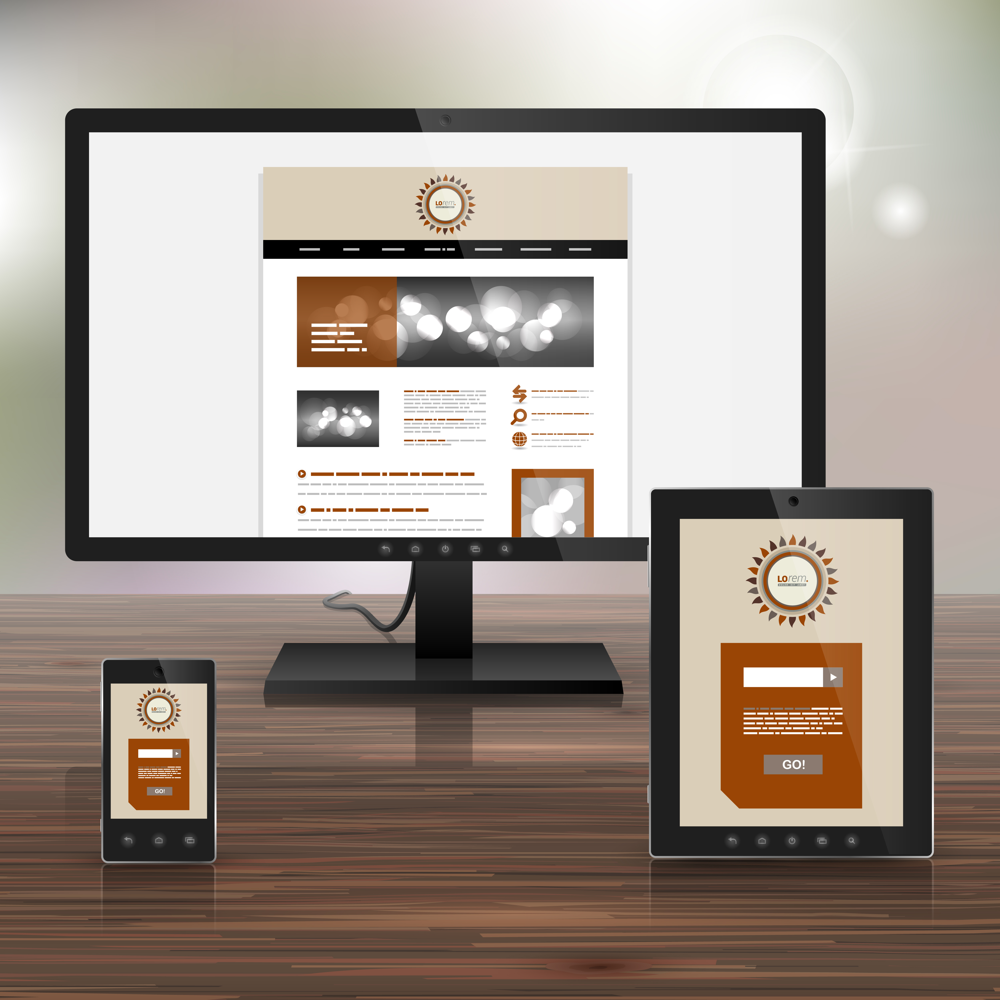
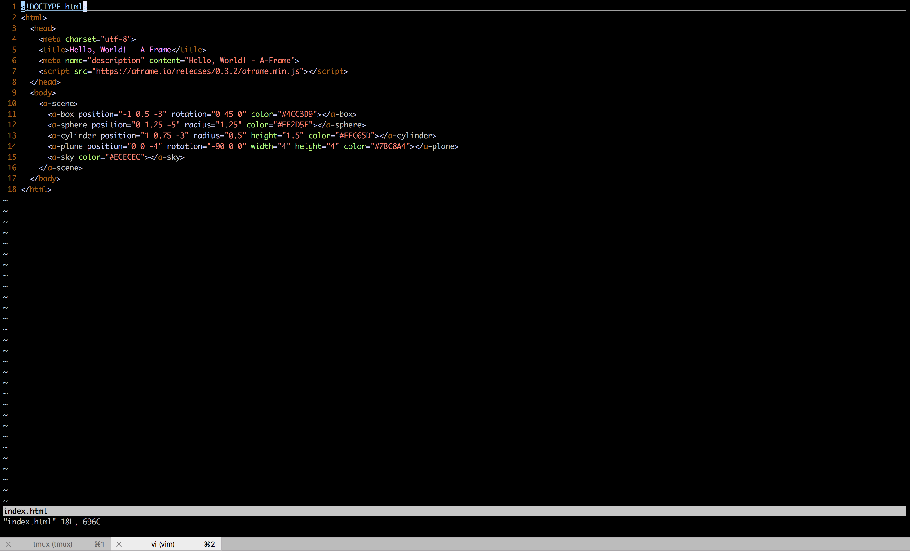
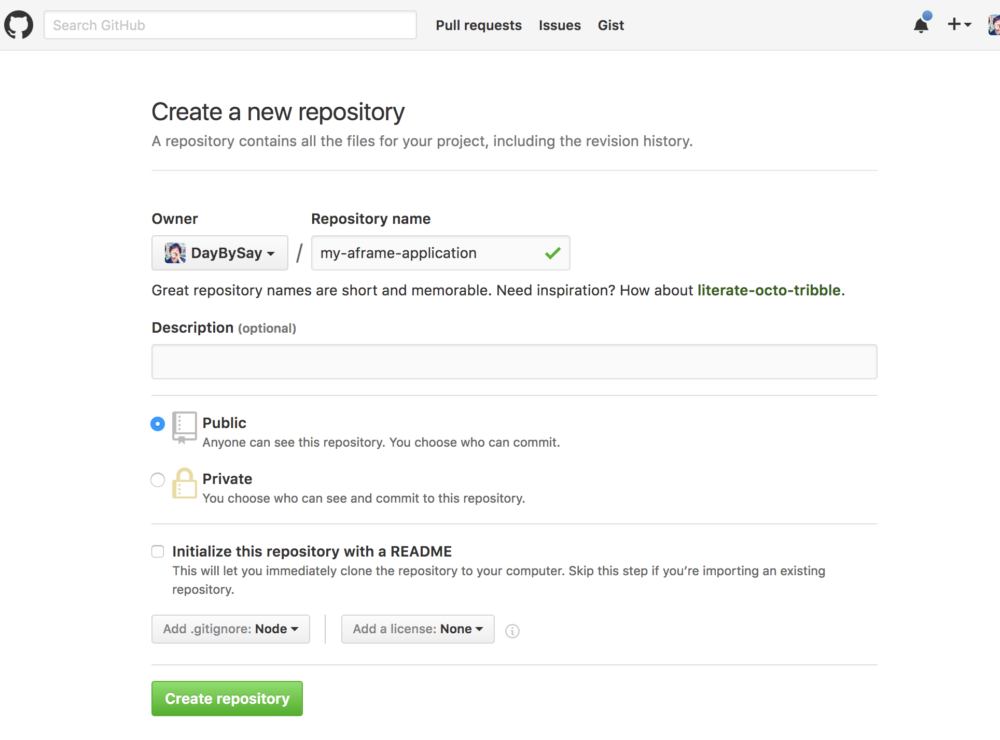
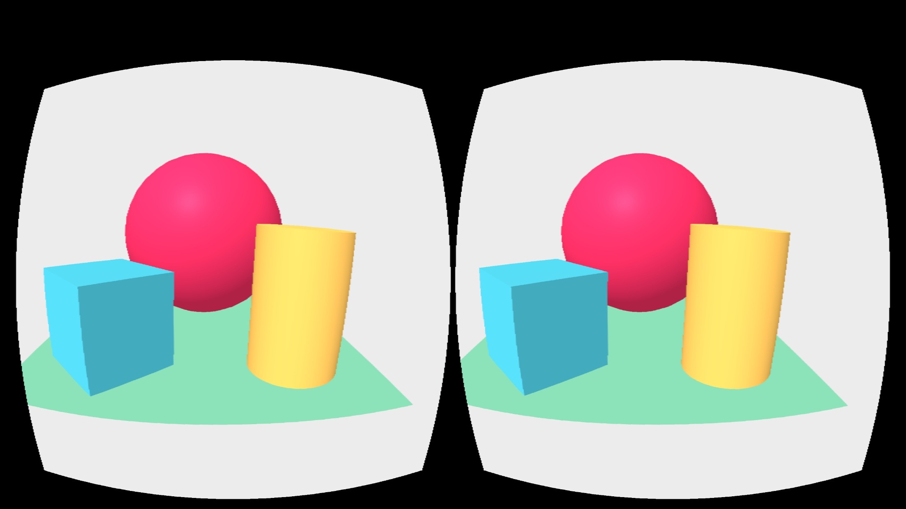
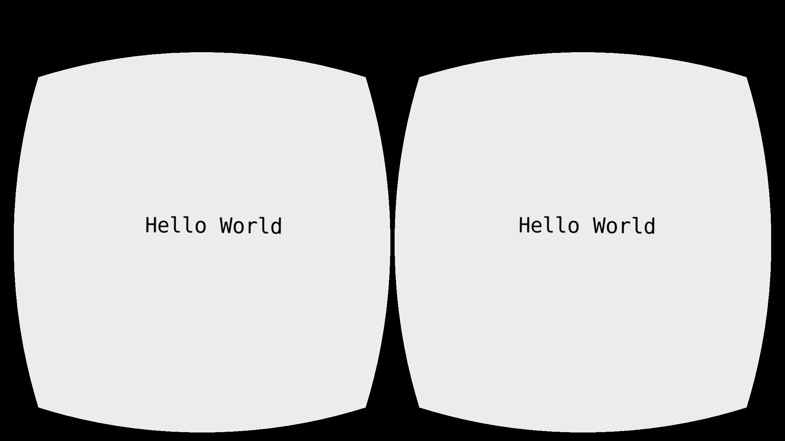

こんにちは。株式会社VOYAGE GROUP VR LAB室の[@daybysay](https://twitter.com/daybysay) と申します。普段はインターネット広告のSDKエンジニアをしております。

今年の10月にVR LAB室というVRコンテンツ開発にトライしていく事業室を社内立ち上げ、そちらでちょろちょろととアプリケーション開発をやっています。

この度、ご縁がありVR Insideさんに寄稿する機会を頂けたので、自分が勉強してきたことのアウトプットをしたいと思います。

今回はVRに興味はあるがまだ触ったことは無いよ〜というエンジニアの方向けに、アプリケーションが開発できる**HMDの特徴**、**VRアプリケーションの種類**、と**WebVRアプリケションの開発方法**についてまとめました！

# 目次

[:contents]

# VRアプリケーション開発が出来るHMDについて


2016年末現在、アプリケーション開発が出来るHMDは下記2つに分類できます。

1. ハイエンドHMD
1. モバイルHMD

また、モバイルHMDの中でもハイエンドとローエンドで分かれています。

## ハイエンドHMD


ハイエンドHMDは、いわゆる**ゲーミングPC**などの据え置き型の端末とセットで使うHMDで、次のような特徴があります。

**良い点**

* ディスプレイのリフレッシュレートが高いため、高FPSで酔いづらいアプリケーションの開発が可能
* ルームスケールに対応しているため、コンテンツ内を歩き回る体験を作り出せる
* 多くの場合ハンドコントローラに対応しているため、VR空間内にユーザの手を再現でき、インタラクションの幅が広い

**悪い点**

* ゲーミングPCとHMDが必要なため、初期のコストが高い(合わせて20万~)
* ルームスケールのコンテンツを体験する広いスペースを用意するのが大変

3Dお絵かきアプリである[TiltBrush](https://www.tiltbrush.com/)や、VR空間で他のユーザと遊べる[Toybox](https://www.oculus.com/experiences/rift/1083042371786607/)など、全身を使う動きのあるコンテンツとの相性が良いです。

<iframe width="560" height="315" src="https://www.youtube.com/embed/TckqNdrdbgk" frameborder="0" allowfullscreen></iframe>

## モバイルHMD


モバイルHMDは、スマホ + HMDで利用できる端末で、ハイエンドのHMDに比べるとインタラクションの種類が限定されてしまったり、扱えるポリゴン数が少ないなど、制約が多いです。

しかし、スマートフォンユーザならHMDを買うだけでVRコンテンツを体験できるので、体験までのハードルが低いです。((ローエンドに限る))

**良い点**

* 安いHMD + お手持ちのスマホでコンテンツが体験できるので、コンテンツ体験までのハードルが低い(**1,000円~**)
* 持ち運びが用意なので場所を選ばない
* (モバイルハイエンド) ハイエンドHMDには劣るものの、ユーザの色々な入力を受けるインターフェイスが備わっている
* (モバイルローエンド) 既存のストアを利用してアプリを配布できる

**悪い点**

* 現状のモバイルHMDだと**ポジショントラッキングができない**ので、コンテンツ内での移動に制約がある((Tango + Daydream Readyの端末はいつ出るのか・・))
* (モバイルローエンド) 多くの場合ハンドコントローラがないので、コンテンツ内のインタフェイスが視線ベースになることが多く、疲れやすい
* (モバイルローエンド) スマホのスペックによって扱えるポリゴン数にかなり差があるので調整が大変

モバイルHMDは場所に関係なく使えるので、例えばNetflixやYoutubeのような動画を見るコンテンツや、リラクゼーション系など、頭だけで使えて動きが少ないコンテンツと相性が良いです。

<iframe width="560" height="315" src="https://www.youtube.com/embed/ROzDHcayl-k" frameborder="0" allowfullscreen></iframe>

これら特性をしっかり把握した上で、どのHMD向けにコンテンツを提供していくか検討をするのが重要です。

# VRアプリケーションの種類


VRアプリケーションのタイプは2種類で、**ネイティブVRアプリケーション**と**WebVRアプリケーション**があります。

## ネイティブVRアプリケーション
ネイティブVRアプリケーションは下記のような特徴を持っています

* WindowsやMacOS、GearVRやDaydreamなどのプラットフォーム経由でアプリケーションをインストールして利用できるネイティブアプリケーション
* Unity、 UE4などのゲームエンジンがVR対応をしており、ゲーム開発をされていた人が参入しやすい
* Oculus RiftやHTC Viveなどのベンダから公式SDKが提供されている
* WebVRに比べてリッチで作り込まれた表現がし易いのと、（多くの場合）Wi-Fiか有線が前提なのでネットワークの制約を気にしなくても良い

いま世の中に存在するVRコンテンツの殆どはネイティブで作られています。

元々UnityやUE4などでゲーム開発をしていた人はすぐに初められるので、ゲームコンテンツや

### ネイティブVRアプリケーションの開発環境

ネイティブのVRコンテンツ開発は、多くの場合下記2つのゲームエンジンで行われています。

1. [UNREAL ENGINE4(UE4)](https://www.unrealengine.com/ja/what-is-unreal-engine-4)
1. [Unity](https://unity3d.com/jp/)

それぞれ特性がありますが、**モバイルに強く情報量が多い**Unityと、**リアルなグラフィックに強く、ブループリントという使いやすいビジュアルスクリプト言語を擁する**UE4というのがざっくりした特徴です。

ちなみに筆者がネイティブVRアプリケーションを開発する際はは基本的にUnityを使っています。(UE4はほぼ使ったことがありません

Unityにおいては[マニュアル](https://docs.unity3d.com/ja/current/Manual/index.html)に基本的な事は書いてありますし、何より世の中に情報が多いのであまりゲーム開発経験が無かった筆者も簡単に開発を始めることが出来ました。

UE4も同様にマニュアルはしっかりしているので、[VR開発について記載も厚いので](https://docs.unrealengine.com/latest/JPN/Platforms/VR/index.html)、折を見て試してみようかと思っています。

## WebVRアプリケーション
下記のような特徴を持っています

* Web上にホスティングされ、ブラウザでURLにアクセスするだけで簡単に体験できるアプリケーション
* WebVR APIを利用し、HMDの情報を扱える(WebVR APIが使えなくてもVRコンテンツ開発は可能)
* WebVR APIはHMD本体、HMD用カメラ(ポジショントラッキング)とブラウザの間をつなぐAPIで、Web GL、Web Audio、GamePad APIと組み合わせてアプリケーションを開発する

WebVRアプリケーションは基本的に[WebVR API](https://github.com/w3c/webvr) を利用して開発を行います。

WebVR APIを正式実装しているブラウザはまだ存在せず、現在[W3Cにドラフトが出ている段階](https://w3c.github.io/webvr/)です。

現在では多くのコンテンツがネイティブアプリケーションとして作られていますが、開発環境やブラウザのWebVR API対応によって、今後はWebアプリケーションも増えてくると予想されます。

ちなみにブラウザのWebVR API対応状況に関しては [Is WebVR Ready?](https://iswebvrready.org/) で確認が可能です。

### WebVRアプリケーションの開発環境


WebVRアプリケーションは、当然HTML + CSS + JSでの開発が可能です。

また、WebVRアプリケーション開発支援のライブラリが存在しており、それらを活用すると簡単にWebVRアプリケーションを作ることが出来ます。

現状利用可能なライブラリは下記です。

* [WebVR Boilerplate](https://github.com/borismus/webvr-boilerplate)
* [React VR](https://github.com/facebookincubator/react-vr)
* [A-Frame](https://github.com/aframevr/aframe/)

これらはJSの3Dライブラリである[Three.js](https://github.com/mrdoob/three.js/)をベースに実装されています。

これらのライブラリの中にがWebVR APIのラッパーが存在するので、Oculus RiftやHTC ViveなどのハイエンドHMD、ハンドコントローラなどの情報が簡単に扱えるようになっています。

元々Three.jsベースでコンテンツを開発されている場合、WebVR Boilerplateを利用すると簡単にVR対応が可能です。

React VRは先日の[Oculus Connectで発表された](https://techcrunch.com/2016/10/06/oculus-webvr/)ライブラリで、現時点ではまだプレリリース状態です。

[React Native](https://facebook.github.io/react-native/)をベースに作られており、JSの独自拡張構文である[JSX](http://facebook.github.io/jsx/)を利用した開発が可能になっています。

A-FrameはWebVRアプリケーション開発を支援するため、Mozilla VRチームが中心となって開発しているOSSのライブラリで、HTMLでVRアプリケーションを作成するためのオープンソースのWebVRフレームワークです。

独自のHTML拡張構文が用意されているのと、[A-Frame Inspector](https://github.com/aframevr/aframe-inspector)よいうビジュアルエディタが用意されているのが特徴です。

[先日リリースされたA-Frame v0.4.0](https://aframe.io/blog/aframe-v0.4.0/)では、新たに[A-Frame Registory](https://aframe.io/aframe-registry/)が公開されました。

これはUnityで言うところのAssetStoreの様なものであり、Registoryに登録されているコンポーネントはInspectorから直接利用出来るという素晴らしい機能を備えています。

開発を始めるに当たって、筆者のお勧めは**A-Frame + [A-Frame-Boilerplate](https://github.com/aframevr/aframe-boilerplate)を使った開発**です。

# A-Frame + A-Frame Boilerplateを使ってWebVRアプリケーションを開発する
さっそくですが、A-Frameを利用したWebVRアプリケーションを作ってみたいと思います。

今回は`git`と`npm`を利用するので、それらの環境を用意して下さい。

## ローカル開発環境の準備
まずは`A-Frame Boilerplate`をローカルにクローンします。

```
git clone https://github.com/aframevr/aframe-boilerplate.git
cd aframe-boilerplate && rm -rf .git && npm install
```

この状態で`npm start`を実行すると、ブラウザが開きA-Frameアプリケーションが表示されます。


これでローカルの開発環境は準備OKです。簡単！

次に、スマホで動作確認できるようにアプリケーションをホスティングしましょう。

## スマートフォンで動作確認するための環境準備
特にこだわりがない & GitHubアカウントをお持ちの方は`GitHub Pages`にホスティングすればよいかと思います。

`A-Frame Boilerplate`が、`GitHub Pages`へのホスティングをサポートしているので、そちらを利用しましょう。

まずはGitHubに公開リポジトリを作ります。



今回は `https://github.com/DayBySay/my-aframe-application` として作成しました。

次に、先程の`aframe-boilerplate`ディレクトリのリモートリポジトリとして、今作成したリポジトリを登録します。

```
git init
git remote add origin git@github.com:<UserName>/<RepositoryName>.git # <UserName> と <RepositoryName> は書き換えて下さい
git add .
npm run deploy
```

これでアプリケーション公開の準備が整いました。

スマートフォンで `https://<UserName>.github.io/<RepositoryName/` を開き、右下のカードボードマークをタップします。



これで開発 -> スマホで動作確認のサイクルを回せるようになりました！

### A-Frameで文字を表示する
せっかくなので少し実装をしてみましょう。

今回は `Hello world` という文字を表示するところまでやってみたいと思います。

A-Frameでテキスト表示する方法はいくつかありますが、[公式に推奨されている](https://aframe.io/docs/0.4.0/introduction/faq.html#how-do-i-display-text-in-a-frame)のは`Bitmap Font Text Component`を利用する方法です。

ディレクトリ直下の`index.html`を下記のように変更して下さい。

```html
<!DOCTYPE html>
<html>
  <head>
    <meta charset="utf-8">
    <title>Hello, World! - A-Frame</title>
    <meta name="description" content="Hello, World! - A-Frame">
    <script src="https://aframe.io/releases/0.4.0/aframe.min.js"></script>
    <script src="https://rawgit.com/bryik/aframe-bmfont-text-component/master/dist/aframe-bmfont-text-component.min.js"></script>
  </head>
  <body>
      <a-scene>
      <a-entity position="-0.6 1.6 -2"
        bmfont-text="color: black; text: Hello World;">
      </a-entity>
      <a-sky color="#ECECEC"></a-sky>
    </a-scene>
  </body>
</html>
```

これをコミットし、また`npm run deploy`でデプロイしましょう。

スマートフォンでさきほどのURLを更新すると、下記のような表示になっていると思います。



文字が表示できました！

A-Frameで日本語を表示する場合は少し頑張る必要があるのですが、それについて[弊社ブログの記事](http://vr-lab.voyagegroup.com/entry/2016/11/16/122115)にまとめているので、ぜひご参照下さい！

# まとめ
これまで話したことをまとめたのが以下です。

* HMDにはハイエンドとモバイルがある
* HMDによってアプリ配信のプラットフォームが違う
* VRアプリケーションにはネイティブとWEBがある
* WebVRアプリ開発はA-FrameとA-Frame Boilerplateで簡単に初められる！

以上、VR開発の概要からWebVRアプリの開発環境構築まで一通り説明させていただきました。

スマートフォンで我々の生活を大きく変わったように、VRも我々の生活を良い方向に進めてくれると信じています。そんな未来を早く実現するためにも、みんなで素晴らしいVRアプリケーションをガンガン作っていきましょう！

ちなみにVOYAGE GROUPではVRアプリケーションを開発したいエンジニアやクリエイターの方を募集しておりますので、[Twitter](https://twitter.com/daybysay)などでお気軽にお声がけ下さい！

それでは、よいVRアプリケーション開発ライフを！

