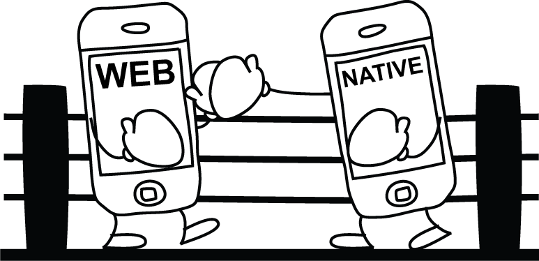
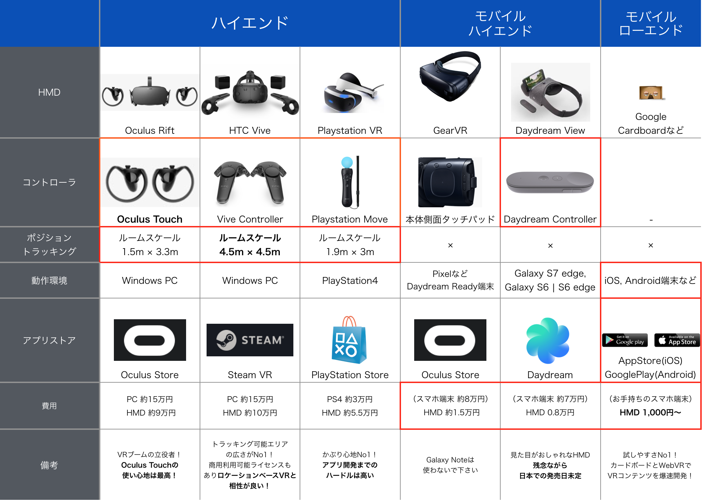
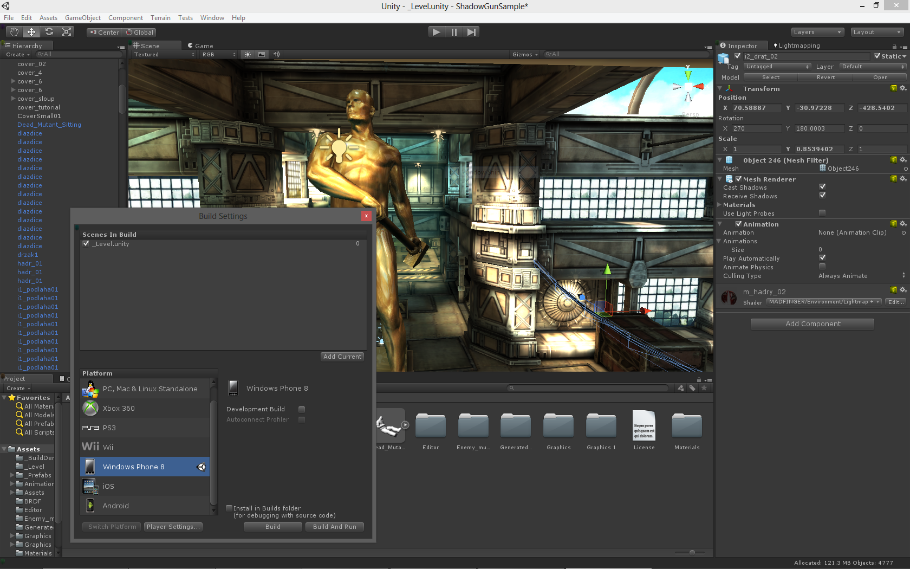
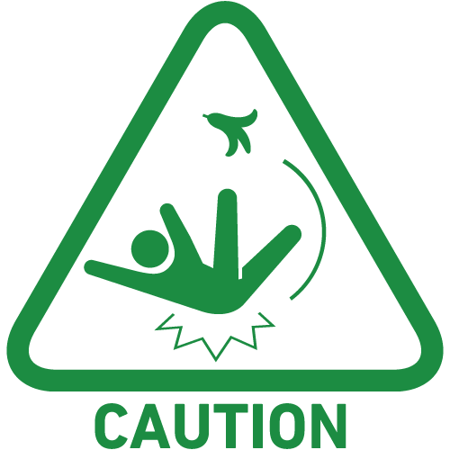
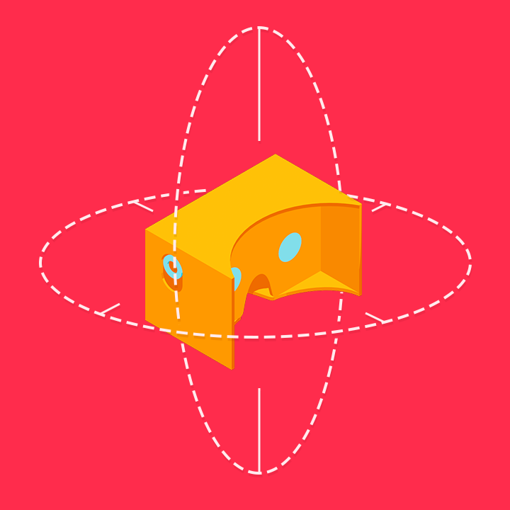
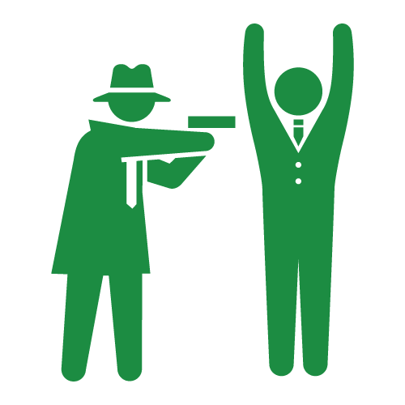
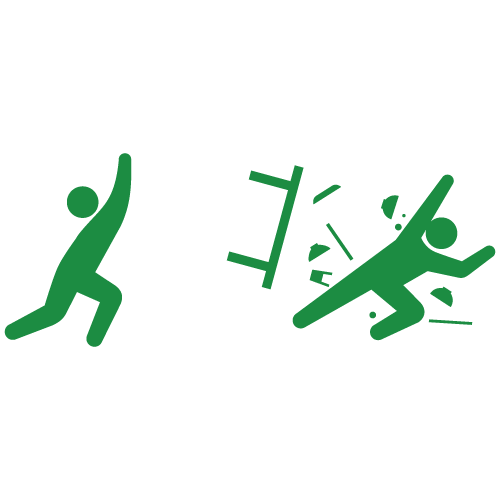
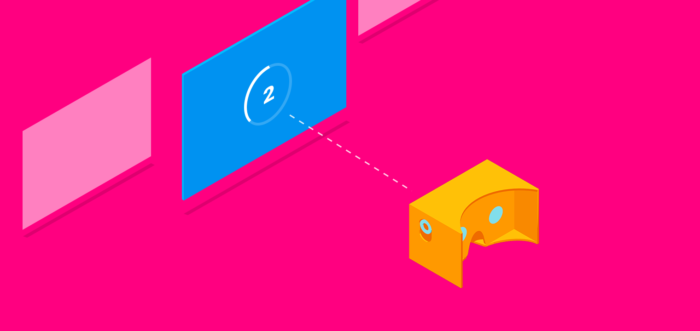

こんにちは。株式会社VOYAGE GROUP VR LAB室の[@daybysay](https://twitter.com/daybysay) です。

本職はインターネット広告のエンジニアですが、今年の10月にVR LAB室という
VRコンテンツ開発にトライしていく事業室を立ち上げ、ちょこちょことアプリケーション開発をしております。

この度、ご縁がありVR Insideさんに寄稿する機会を頂けたので、自分が勉強してきたことのアウトプットをしたいと思います。

今回はVRに興味はあるがまだ触ったことは無いよ、というエンジニアの方向けに、開発者視点でVRコンテンツ開発と環境についてまとめました。

この記事を読んだ方に、**VRのアプリにはどんな種類があるのか？**と、**どんな開発環境があるのか？**、**どんな事に気をつければよいのか？**を知って頂き、今後のVRコンテンツ開発に役立てて頂ければ幸いです！

# 目次

[:contents]

### アプリケーションのタイプ


現在公開されているVRコンテンツのアプリケーションのタイプは2種類で、**ネイティブアプリケーション**と**Webアプリケーション**があります。

それぞれ下記のような特徴を持っています。

* ネイティブVRアプリケーション
	* WindowsやMacOS、GearVRやDaydreamなどのプラットフォーム経由でアプリケーションをインストールして利用できるネイティブアプリケーション
	* Unity, UE4など、VRコンテンツ開発をサポートする強力なゲームエンジンが存在する
	* Oculus RiftやHTC Viveなどベンダの公式からSDKが提供されている事が多い
	* OSネイティブのAPIを叩けるので出来ることの幅が広い
	* WebVRに比べてリッチで作り込まれた表現がし易いのと、（多くの場合）Wi-Fiか有線が前提なので扱うファイルサイズの制約が少ない

* WebVRアプリケーション
	* Web上にホスティングされ、インストール不要で簡単に体験できるアプリケーション
	* WebVR APIを利用し、HMDの情報を扱える(WebVR APIが使えなくてもVRコンテンツ開発は可能)
	* WebVR APIはHMD本体、HMD用カメラ(ポジショントラッキング)とブラウザの間をつなぐAPIで、Web GL、Web Audio、GamePad APIと組み合わせてアプリケーションを開発する
	* ブラウザベースなのでURLのみでアクセス可能
	* A-Frameなど、ブラウザ上でVRを実現するためのライブラリが存在する

WebVRアプリケーションは、ブラウザベースで動作するVRコンテンツであり、[WebVR API](https://github.com/w3c/webvr) を利用した開発が出来ます。
WebVR APIはHMDとカメラ、現在[W3Cにドラフトが出ている段階](https://w3c.github.io/webvr/)です。

現在では多くのコンテンツがネイティブアプリケーションとして作られていますが、開発環境やブラウザのWebVR API対応によって、今後はWebアプリケーションも増えてくると予想されます。

ブラウザのWebVR API対応状況に関しては [Is WebVR Ready?](https://iswebvrready.org/) で確認が可能です。

これらの特徴をもったVRコンテンツは様々なHMDを利用しており、それぞれのHMDの性質に合わせたコンテンツが開発されています。

コンテンツを開発する上で、**どんな種類のHMDがあるのか？**、また、**どんな特性をもっているのか？**というのはかなり重要なポイントになりますので、そちらを整理したいと思います。

# 開発に使われるHMDの種別
今回はよく開発に使われている代表的なHMDをとりあげ、下記の図にまとめました。



2016年末現在、我々がコンテンツ開発が出来るHMDは下記2つに分類できます。

1. ハイエンドHMD
1. モバイルHMD

また、モバイルHMDの中でもハイエンドとローエンドで分かれています。

## ハイエンドHMD


ハイエンドHMDは、いわゆる**ゲーミングPC**などの据え置き型の端末とセットで使うHMDで、次のような特徴があります。

良い点
* リフレッシュレートが高いため、ヘッドトラッキングの精度が高い
* ルームスケールに対応しているため、コンテンツ内を歩き回る体験を作り出せる
* ハンドコントローラに対応しているため、VR空間内にユーザの手を再現できる

悪い点
* ゲーミングPCとHMDが必要なため、初期のコストが高い(合わせて20万~)
* ルームスケールのコンテンツを体験する広いスペースを用意するのが大変

3Dお絵かきアプリである TiltBrush や、VR空間で他のユーザと遊べる Toyboxなど、全身を使う動きのあるコンテンツとの相性が良いです。

## モバイルHMD


モバイルHMDは、スマホ + HMDで利用できる端末で、ハイエンドHMDに比べるとインタラクションの種類が限定されてしまったり、扱えるポリゴン数が少ないなど、制約がおおいです。しかし、HMDさえ追加購入するだけで体験できるコンテンツを作れますので、体験までのハードルが低いです。

良い点
* 安いHMD + お手持ちのスマホでコンテンツが体験できるので、コンテンツ体験までのハードルが低い(1,000円~)
* 持ち運びが用意なので場所を選ばない
* (モバイルハイエンド) ハイエンドHMDには劣るものの、ユーザの色々な入力を受けるインターフェイスが備わっている
* (モバイルローエンド) 既存のストアを利用してアプリを配布できる

悪い点
* 現状のモバイルHMDだとポジショントラッキングができないので、コンテンツ内での移動に制約がある
* (モバイルローエンド) 多くの場合ハンドコントローラがないので、コンテンツ内のインタフェイスが視線ベースになることが多く、疲れやすい
* (モバイルローエンド) スマホのスペックによって扱えるポリゴン数にかなり差があるので調整が大変

モバイルHMDは場所に関係なく使えるので、例えばNetflixやYoutubeのような動画を見るコンテンツや、リラクゼーション系など、頭だけで使えて動きが少ないコンテンツと相性が良いです。

これらHMDの特性をしっかり把握した上で、どこに対してコンテンツを提供していくか検討をするのが重要です。

# VRコンテンツ開発環境


VRコンテンツの開発環境は、先程お話した**コンテンツのタイプ**により大きく違います。

## ネイティブアプリケーション
ネイティブのVRコンテンツ開発は、多くの場合下記2つのゲームエンジンで行われています。

1. [Unity](https://unity3d.com/jp/)
1. [UNREAL ENGINE4(UE4)](https://www.unrealengine.com/ja/what-is-unreal-engine-4)

ざっくりとした紹介をすると、簡単に使えて情報量が多いUnityと、リアルなグラフィックの作り込みが出来るUE4といった印象です。

それぞれ他にも特性を持っておりますが、特にこだわりがなければ情報が豊富で有料のアセット購入が簡単に出来る**Unity**の利用をお勧めします。

## Webアプリケーション
HTML + CSS + JSでの開発が可能です。お好みのエディタで開発が可能です。ちなみに筆者はVimで開発しています。

## おすすめの開発環境と構築方法
とりあえずVR開発を始めるに当たって、筆者のお勧めは**A-Frame + Google Cardboardを使ったWebVR開発**です。

A-FrameはWebVRアプリケーション開発を支援するため、Mozilla VRチームが中心となって開発しているOSSのライブラリです。

JSでの3Dのコンテンツ開発を可能とする**Three.js**をベースとし、ヘッドトラッキングや両眼立体視を簡単に実現できる機能などが追加されています。

また、Oculus RiftやHTC ViveなどのハイエンドHMDや、ハンドコントローラなども簡単に扱えるようになっており、色々なプラットフォームに対応できるのも魅力の一つです。

<iframe src="https://aframe.io/examples/showcase/helloworld/"></iframe>

A-Frameの使い方に関しては[公式のチュートリアル](https://aframe.io/docs/0.3.0/introduction/getting-started.html)にきれいにまとまっているので、そちらをご参照下さい。

ちなみにA-Frameを用いたアプリ開発環境の構築は[A-Frame Boilerplate](https://github.com/DayBySay/aframe-boilerplate)の利用で簡単に実現できます。

```
$ git clone https://github.com/aframevr/aframe-boilerplate.git
$ cd aframe-boilerplate && rm -rf .git && npm install && npm start
$ open http://localhost:3000/
```

詳しい使い方は[弊社ブログの記事](http://vr-lab.voyagegroup.com/entry/2016/12/15/120544)にございますので、そちらをご参照下さい。

# 開発時の注意点


VRコンテンツは既存のPCやスマホ向けコンテンツに比べて人体に与える影響が大きく、不快な体験をしたユーザはVRコンテンツが嫌いになる可能性が高いです。

それを防ぐためにも、開発時は下記のポイントに気をつけた設計、実装を行いましょう。

1. VR酔いを防ぐ
1. VR空間に即したインタラクションを利用する

## VR酔いについて


VRコンテンツは乗り物酔いのように、ユーザに嘔気を伴う症状を引き起こす可能性があります。これが起きる理由は色々あるものの、特に視覚と身体感覚の不一致で引き起こされがちです。

これを防ぐためにまず意識すべきなのは下記ポイントになります。

* ヘッドトラッキングを止めない
* FPS(Frame per Scound)を高く保つ(最低60fps)

### ヘッドトラッキングを止めない


ヘッドトラッキングを止めるのは一番やってはいけないことです。これは新しいシーンのロードやデバイスの機能の限界を超えた時に発生することがありますので、十分注意しましょう。

どうしてもトラッキングを止めなければ行けないときは画面をフェードアウトさせる、またその時にオーディオを流してアプリが起動中であることをユーザに示しましょう。フェードアウトにかける時間が早すぎるとユーザが混乱してしまうので、十分な時間をかけてフェードアウトさせるのが有効です。

### FPSを高く保つ


FPSが低くヘッドトラッキングの精度が低い状態もかなりの不快感に繋がります。FPSは1フレーム毎に重い処理が実行されていたり、利用しているモデルのポリゴン数が多すぎる時などに起きがちです。開発しているコンテンツが実機でどれくらいのFPSを出せるか？は常にチェックしながら調整しましょう。

### その他Tips
上記以外のVR酔いを防ぐためのTipsです。

* 移動
	* 移動をワープのみで行う
	* 等速移動にする(加速させない)
	* 低速にする
	* 直線運動にする
	* 移動させるなら前方
	* そもそも移動しない
* カメラ
	* 画面内に固定のオブジェクトを置く(例えばコクピットや顔についてる鼻など)
	* 上下に揺らさない
	* 移動時は3人称視点に切り替える
	* 1度に更新される視覚情報の量を減らす(視野を狭める)
	* 常に水平を保つ
* 表現
	* 次に起きる事象を予測させる(ジェットコースターのレールであったり、先導者を置くなど)
	* 明度や彩度の大きな変化を避ける(なるべくマット目に)
	* 細かい模様の壁や雪を降らせるなど、目に負荷をかける表現を避ける
	* 物理的な衝撃が強そうな演出を避ける(壁にぶつけるなど)

大きい方向性としては、ユーザの記憶や経験と違う表現や、期待・予測と違う表現を避けるのがポイントです。

経験上、移動を扱うコンテンツはかなり酔いやすいので、初めのうちは移動しないコンテンツから入るのがおすすめです。

## インタラクションについて


VRコンテンツ内でのインタラクションですが、ハンドコントローラがあるかないかで大きく変わってきます。ハンドコントローラがある場合は手を模したインタフェイスを使えますが、ない場合は**視線を利用したインタラクション**をする事になります

現状のWebVR開発では視線ベースのコンテンツがメインです。視線を利用したインタラクションはある程度パターンが決まっており、最低限下記に気をつければ問題ない事が多いです。

* レティクルを使う
* ヒューズボタンを使う

### レティクルを使う


レティクルとはユーザの視線がどこをターゲティングしているか表示する為のUIです。ユーザが視線でオブジェクトを選択しようとするタイミングで必ず表示して下さい。

レティクルを表示する場合、立体的に、奥行きを感じられるようにターゲットのオブジェクト上に投影しましょう。レティクルとターゲットの間を開けすぎると、両方を同時に捉えるのが難しくなってしまい違和感を感じます。レティクルのサイズは奥行きに比例させるか、常に固定のサイズを維持し、見易さを担保しましょう。

因みにA-Frame向けのコンポーネントとして弊社VR室の伊藤が[奥行きに合わせたレティクルを表示できるコンポーネントを公開](https://www.npmjs.com/package/aframe-crawling-cursor)しているので、よかったらご利用下さい。

### ヒューズボタンを使う


ヒューズボタンとは、ユーザが特定の時間見つめたときにトリガーされるボタンです。

上記の説明の通り、ヒューズボタンはオブジェクトを数秒間見つめる必要があります。これはアクションが実行されるまで待つ必要があり、遅く感じる上にユーザにストレスを与えます。

ヒューズボタンを利用する際は下記のポイントに注意して下さい。

* カウントダウンを表示する
* カウントダウンの時間を長くしすぎない
* ボタンが反応する範囲を狭くしすぎない
* ボタン同士の感覚を十分あける

カウントダウンを表示しない場合ミスクリックしやすく、その際アプリケーションの状態が変わった理由をユーザが理解できないので、必ず表示しましょう。

ボタンの範囲が狭いと、ターゲティングがはずれてカウントダウンをやり直す機会が増えてしまうので非常にストレスフルです。また、複数の小さなヒューズボタンが近接して配置されていると間違ったボタンを誤クリックする可能性があるので、ボタンの範囲をある程度大きく撮った上で、オブジェクト同士の距離は十分あけて配置しましょう。

### その他Tips
上記以外の視線を利用したインタラクション時のTipsです。

* スクロールを使わない
* ドラッグさせない
* オブジェクトをターゲティングしている間のみ表示されるビューのような表現を使わない
* 首の可動域を考えてオブジェクトを配置する(左右に60°程度)

視線ベースのインタラクションは多くのユーザにとって慣れないインタフェイスですので、なるべく疲れないような気遣いが重要です。

# まとめ
以上、VRコンテンツの種類や特性、開発環境から開発時の注意点まで広く浅く説明させていただきました。

VOYAGE GROUPではVRコンテンツを開発したいエンジニアやクリエイターの方を募集しておりますので、[Twitter](https://twitter.com/daybysay)などでお気軽にお声がけ下さい！

それでは、よいVRコンテンツ開発ライフを！

