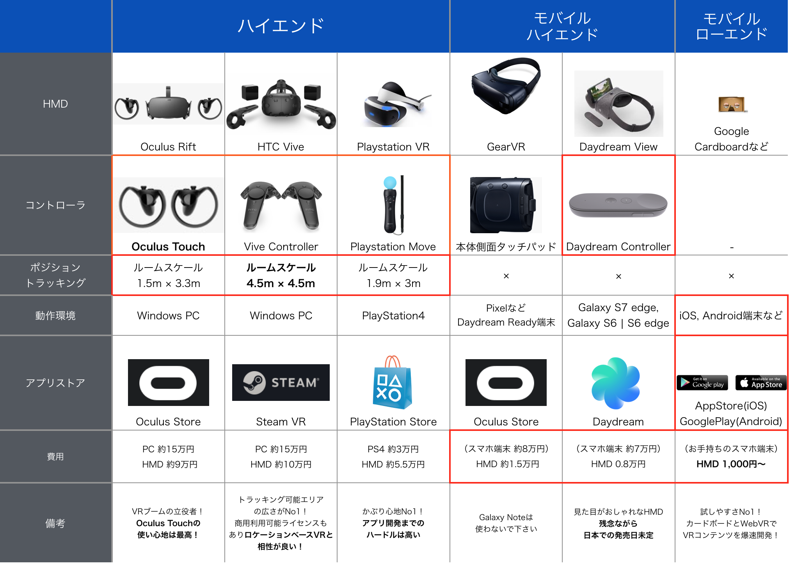
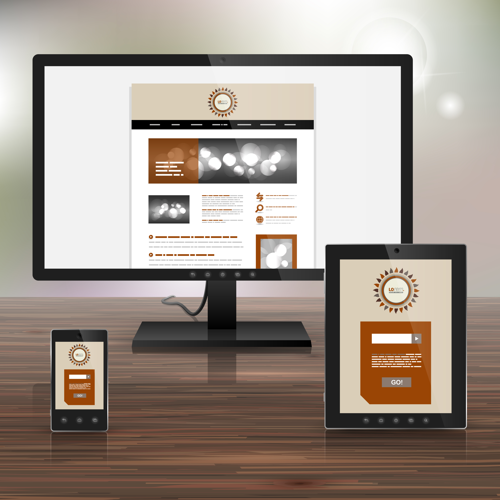
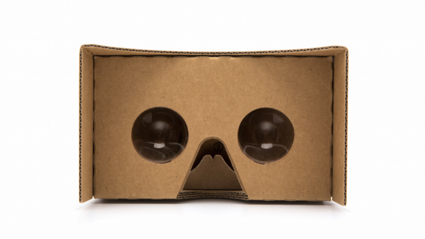

こんにちは。株式会社VOYAGE GROUP VR LAB室の[@daybysay](https://twitter.com/daybysay) です。

本職はインターネット広告のエンジニアですが、今年の10月にVR LAB室という
VRコンテンツ開発にトライしていく事業室を立ち上げ、ちょこちょことアプリケーション開発をしております。

この度、ご縁がありVR Insideさんに寄稿する機会を頂けたので、自分が勉強してきたことのアウトプットをしたいと思います。

今回はVRに興味はあるがまだ触ったことは無いよ、というエンジニアの方向けに、今開発できる**VRアプリケーションの種類**と**開発の仕方**についてまとめました！

# 目次

[:contents]

# アプリケーション開発が出来るHMDについて



2016年末現在、アプリケーション開発が出来るHMDは下記2つに分類できます。

1. ハイエンドHMD
1. モバイルHMD

また、モバイルHMDの中でもハイエンドとローエンドで分かれています。

## ハイエンドHMD


ハイエンドHMDは、いわゆる**ゲーミングPC**などの据え置き型の端末とセットで使うHMDで、次のような特徴があります。

良い点
* リフレッシュレートが高いため、ヘッドトラッキングの精度が高い
* ルームスケールに対応しているため、コンテンツ内を歩き回る体験を作り出せる
* ハンドコントローラに対応しているため、VR空間内にユーザの手を再現できる

悪い点
* ゲーミングPCとHMDが必要なため、初期のコストが高い(合わせて20万~)
* ルームスケールのコンテンツを体験する広いスペースを用意するのが大変

3Dお絵かきアプリである TiltBrush や、VR空間で他のユーザと遊べる Toyboxなど、全身を使う動きのあるコンテンツとの相性が良いです。

## モバイルHMD


モバイルHMDは、スマホ + HMDで利用できる端末で、ハイエンドHMDに比べるとインタラクションの種類が限定されてしまったり、扱えるポリゴン数が少ないなど、制約がおおいです。しかし、HMDさえ追加購入するだけで体験できるコンテンツを作れますので、体験までのハードルが低いです。

良い点
* 安いHMD + お手持ちのスマホでコンテンツが体験できるので、コンテンツ体験までのハードルが低い(1,000円~)
* 持ち運びが用意なので場所を選ばない
* (モバイルハイエンド) ハイエンドHMDには劣るものの、ユーザの色々な入力を受けるインターフェイスが備わっている
* (モバイルローエンド) 既存のストアを利用してアプリを配布できる

悪い点
* 現状のモバイルHMDだとポジショントラッキングができないので、コンテンツ内での移動に制約がある
* (モバイルローエンド) 多くの場合ハンドコントローラがないので、コンテンツ内のインタフェイスが視線ベースになることが多く、疲れやすい
* (モバイルローエンド) スマホのスペックによって扱えるポリゴン数にかなり差があるので調整が大変

モバイルHMDは場所に関係なく使えるので、例えばNetflixやYoutubeのような動画を見るコンテンツや、リラクゼーション系など、頭だけで使えて動きが少ないコンテンツと相性が良いです。

これらHMDの特性をしっかり把握した上で、どこに対してコンテンツを提供していくか検討をするのが重要です。

# アプリケーションの種類


VRアプリケーションのタイプは2種類で、**ネイティブアプリケーション**と**Webアプリケーション**があります。

それぞれ下記のような特徴を持っています。

* ネイティブVRアプリケーション
	* WindowsやMacOS、GearVRやDaydreamなどのプラットフォーム経由でアプリケーションをインストールして利用できるネイティブアプリケーション
	* Unity, UE4など、VRコンテンツ開発をサポートする強力なゲームエンジンが存在する
	* Oculus RiftやHTC Viveなどベンダの公式からSDKが提供されている事が多い
	* OSネイティブのAPIを叩けるので出来ることの幅が広い
	* WebVRに比べてリッチで作り込まれた表現がし易いのと、（多くの場合）Wi-Fiか有線が前提なので扱うファイルサイズの制約が少ない

* WebVRアプリケーション
	* Web上にホスティングされ、インストール不要で簡単に体験できるアプリケーション
	* WebVR APIを利用し、HMDの情報を扱える(WebVR APIが使えなくてもVRコンテンツ開発は可能)
	* WebVR APIはHMD本体、HMD用カメラ(ポジショントラッキング)とブラウザの間をつなぐAPIで、Web GL、Web Audio、GamePad APIと組み合わせてアプリケーションを開発する
	* ブラウザベースなのでURLのみでアクセス可能
	* A-Frameなど、ブラウザ上でVRを実現するためのライブラリが存在する

WebVRアプリケーションは、ブラウザベースで動作するVRコンテンツであり、[WebVR API](https://github.com/w3c/webvr) を利用した開発が出来ます。
WebVR APIはHMDとカメラ、現在[W3Cにドラフトが出ている段階](https://w3c.github.io/webvr/)です。

現在では多くのコンテンツがネイティブアプリケーションとして作られていますが、開発環境やブラウザのWebVR API対応によって、今後はWebアプリケーションも増えてくると予想されます。

ブラウザのWebVR API対応状況に関しては [Is WebVR Ready?](https://iswebvrready.org/) で確認が可能です。

これらの特徴をもったVRコンテンツは様々なHMDを利用しており、それぞれのHMDの性質に合わせたコンテンツが開発されています。

コンテンツを開発する上で、**どんな種類のHMDがあるのか？**、また、**どんな特性をもっているのか？**というのはかなり重要なポイントになりますので、そちらを整理したいと思います。


# ネイティブアプリケーションの開発環境

ネイティブのVRコンテンツ開発は、多くの場合下記2つのゲームエンジンで行われています。

1. [Unity](https://unity3d.com/jp/)
1. [UNREAL ENGINE4(UE4)](https://www.unrealengine.com/ja/what-is-unreal-engine-4)

ざっくりとした紹介をすると、簡単に使えて情報量が多いUnityと、リアルなグラフィックの作り込みが出来るUE4といった印象です。

## おすすめの開発環境と構築方法
それぞれ他にも特性を持っておりますが、特にこだわりがなければ情報が豊富で有料のアセット購入が簡単に出来る**Unity**の利用をお勧めします。

Unityの詳細に関しては[公式のイントロダクション](https://unity3d.com/jp/learn)をご参照下さい。

# Webアプリケーションの開発環境


既存の多くのコンテンツはネイティブで作られていますが、最近[モバイルのChromeベータ版がWebVR APIに対応をする](http://jp.techcrunch.com/2016/12/14/20161213google-introduces-webvr-api-to-latest-chrome-beta-on-android/)など、ブラウザでもVRアプリケーションを実行する環境が徐々に整備されています。

WebVRアプリは、当然HTML + CSS + JSでの開発が可能です。
## おすすめの開発環境と構築方法
とりあえずVR開発を始めるに当たって、筆者のお勧めは**A-Frame + A-Frame-Boilerplateを使ったWebVR開発**です。

A-FrameはWebVRアプリケーション開発を支援するため、Mozilla VRチームが中心となって開発しているOSSのライブラリで、HTMLでVRアプリケーションを作成するためのオープンソースのWebVRフレームワークです。

JSでの3Dのコンテンツ開発を可能とする**Three.js**をベースとし、ヘッドトラッキングや両眼立体視を簡単に実現できる機能などが追加されています。

また、Oculus RiftやHTC ViveなどのハイエンドHMDや、ハンドコントローラなども簡単に扱えるようになっており、色々なプラットフォームに対応できるのも魅力の一つです。

A-Frameの詳細に関しては[公式のイントロダクション](https://aframe.io/docs/0.4.0/introduction/)をご参照下さい。

# A-Frame Boilerplateを使って開発環境を構築する

早速A-Frameを利用したVRアプリケーションの開発環境を整えていきましょう。

`git`と`npm`を利用するので、それぞれ使えるようにインストールをしておいて下さい。

まずは`A-Frame Boilerplate`をローカルに落としてきます。

```
git clone https://github.com/aframevr/aframe-boilerplate.git
cd aframe-boilerplate && rm -rf .git && npm install
```

この状態で`npm start`を実行すると、ブラウザが開きA-Frameアプリケーションが表示されます。

これでローカルの開発環境は準備OKです。簡単！

次に、スマホで動作確認できるようにアプリケーションをホスティングしましょう。

特にこだわりがない & GitHubアカウントをお持ちの方は`GitHub Pages`にホスティングすればよいかと思います。

`A-Frame Boilerplate`が、`GitHub Pages`へのホスティングに対応しているので、非常に簡単に公開できます！！

まずはGitHubに公開リポジトリを作りましょう。

今回は `https://github.com/DayBySay/my-aframe-application` として作成しました。

```
git init
git remote add origin git@github.com:<UserName>/<RepositoryName>.git # <UserName> と <RepositoryName> は書き換えて下さい
git add .
npm run deploy
```

これでアプリケーション公開の準備が整いました。

スマートフォンなどで `https://<UserName>.github.io/<RepositoryName/` を開き、右下のカードボードマークをタップします。

これで開発 -> スマホで動作確認のサイクルを回せるようになりました！

### A-Frameで文字を表示する
せっかくなので少し実装をしてみましょう。

今回は `Hello world` という文字を表示するところまでやってみたいと思います。

A-Frameでテキスト表示する方法はいくつかありますが、[公式に推奨されている](https://aframe.io/docs/0.4.0/introduction/faq.html#how-do-i-display-text-in-a-frame)のは`Bitmap Font Text Component`を利用する方法です。

ディレクトリ直下の`index.html`を下記のように変更して下さい。

```html
<!DOCTYPE html>
<html>
  <head>
    <meta charset="utf-8">
    <title>Hello, World! - A-Frame</title>
    <meta name="description" content="Hello, World! - A-Frame">
    <script src="https://aframe.io/releases/0.4.0/aframe.min.js"></script>
    <script src="https://rawgit.com/bryik/aframe-bmfont-text-component/master/dist/aframe-bmfont-text-component.min.js"></script>
  </head>
  <body>
      <a-scene>
      <a-entity position="-0.6 1.6 -2"
        bmfont-text="color: black; text: Hello World;">
      </a-entity>
      <a-sky color="#ECECEC"></a-sky>
    </a-scene>
  </body>
</html>
```

これをコミットし、また`npm deploy`でデプロイしましょう。

スマートフォンでさきほどのURLを更新すると、下記のような表示になっていると思います。

文字が表示できました！

日本語を表示する場合は別の方法を取る必要があるのですが、それについて[弊社ブログの記事](http://vr-lab.voyagegroup.com/entry/2016/11/16/122115)にまとめているので、ぜひご参照下さい！

# まとめ
これまで話したことをまとめたのが以下です。

* HMDによってコントロールとプラットフォームが違う
* アプリケーションにはネイティブとWEBがある
* ネイティブアプリ開発はUnityで
* WebVRアプリ開発はA-Frameで

です！

ちなみにVOYAGE GROUPではVRコンテンツを開発したいエンジニアやクリエイターの方を募集しておりますので、[Twitter](https://twitter.com/daybysay)などでお気軽にお声がけ下さい！

それでは、よいVRコンテンツ開発ライフを！

